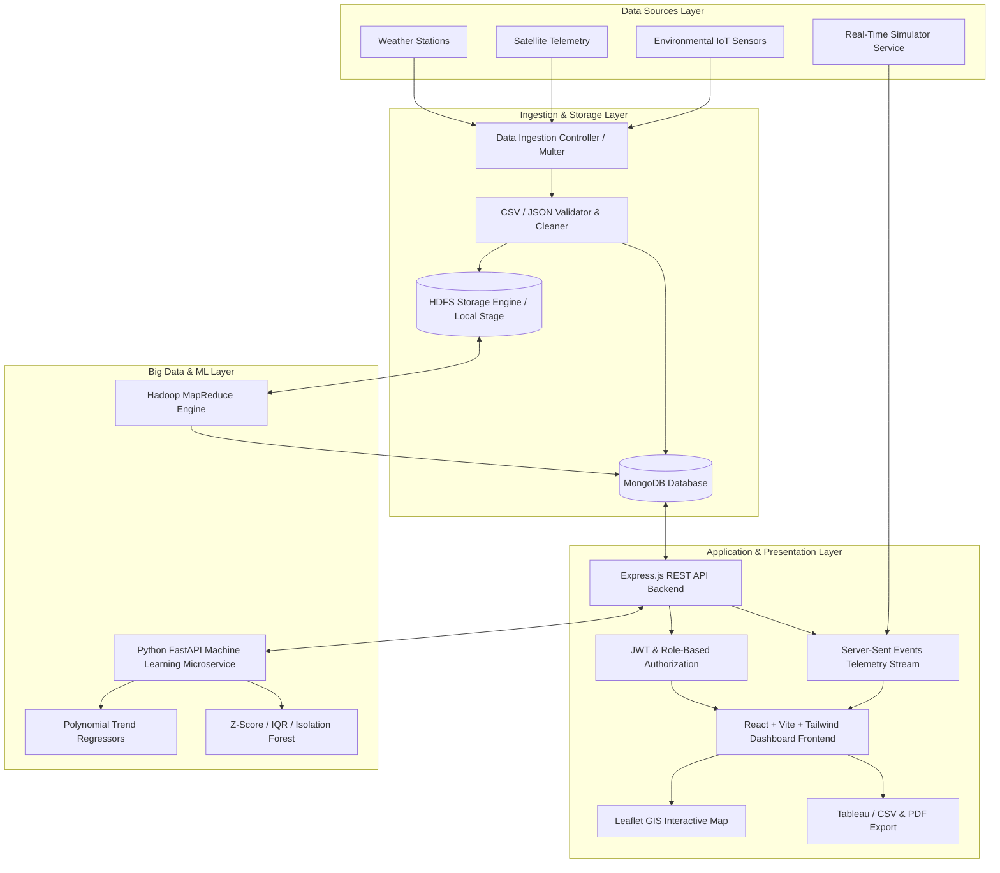
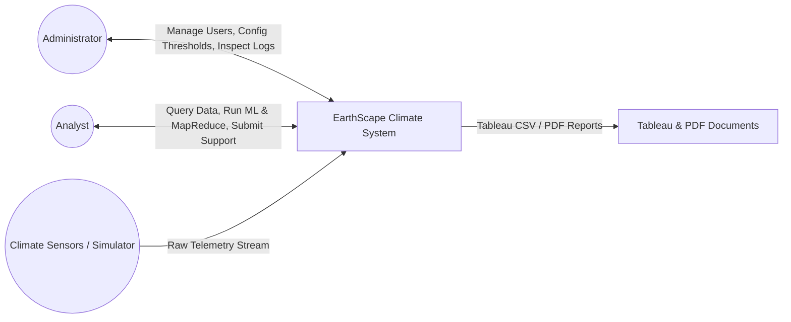
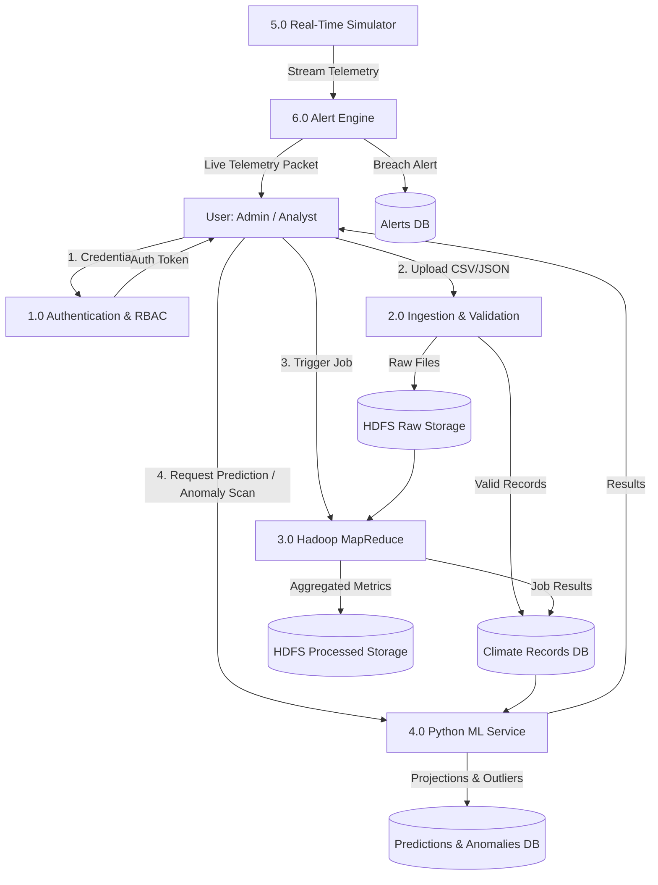
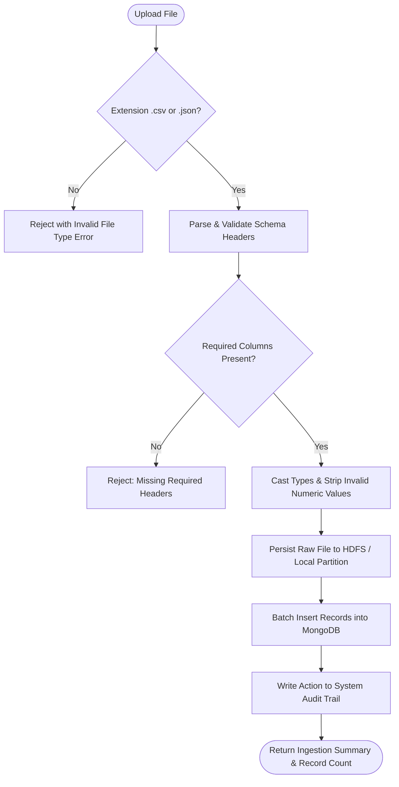
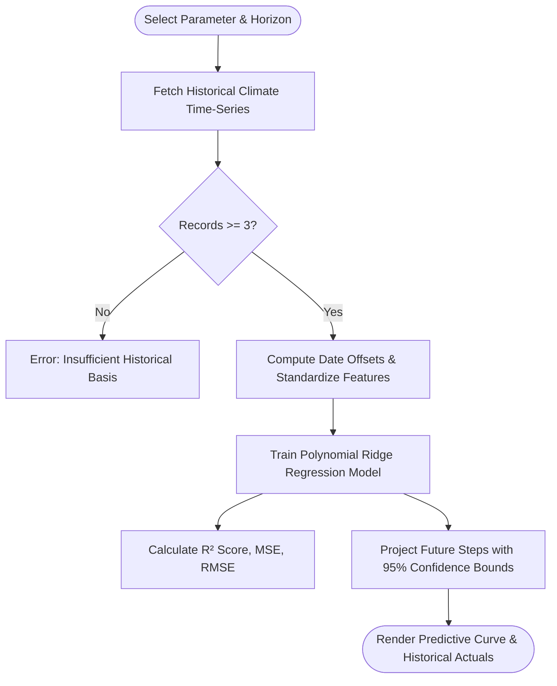

# EarthScape Climate Agency – System Architecture & Data Flow Diagrams

## 1. High-Level System Architecture

---

## 2. Context-Level DFD (Level 0)

---

## 3. Data Flow Diagram Level 1

---

## 4. Operational Flowcharts

### A. Data Ingestion & Validation Flowchart

### B. Machine Learning Trend Prediction Flowchart
