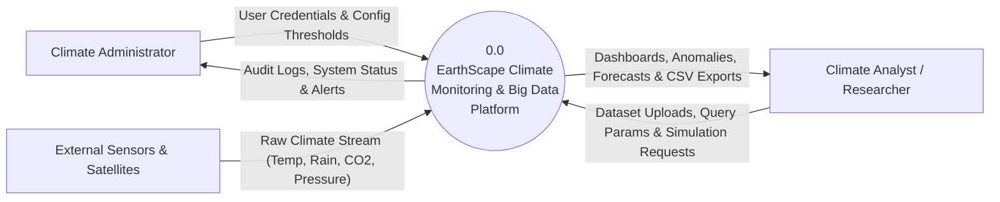
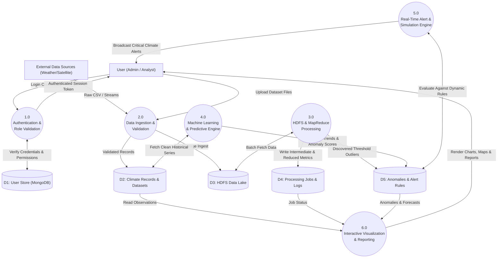
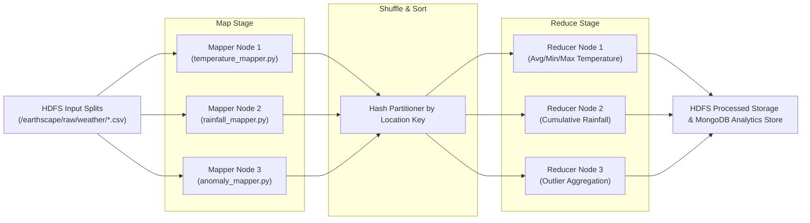
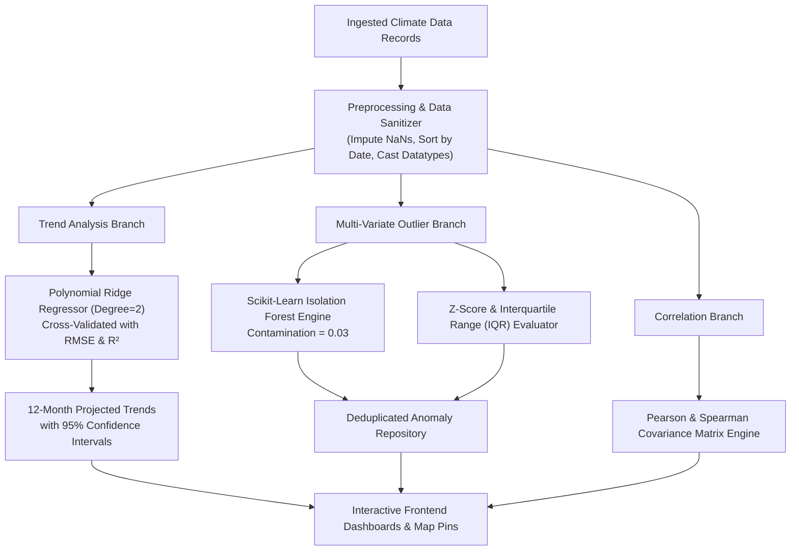

# EarthScape Climate Agency - Data Flow Diagrams (DFDs)

This document specifies the Data Flow Diagrams across three decomposition levels: Context Level (Level 0), Subsystem Level (Level 1), and Process Detailed Level (Level 2).

---

## 1. DFD Level 0: Context Level Diagram

The Context Diagram defines the system boundary for the EarthScape Climate Platform and highlights external entities interacting with the platform.

---

## 2. DFD Level 1: Subsystem Decomposition Diagram

Level 1 decomposes the EarthScape platform into core functional subsystems and data stores.

---

## 3. DFD Level 2: Detailed Process Pipelines

### 3.1 Data Flow 2.1: Hadoop MapReduce Data Pipeline

### 3.2 Data Flow 2.2: Machine Learning Prediction & Anomaly Pipeline

