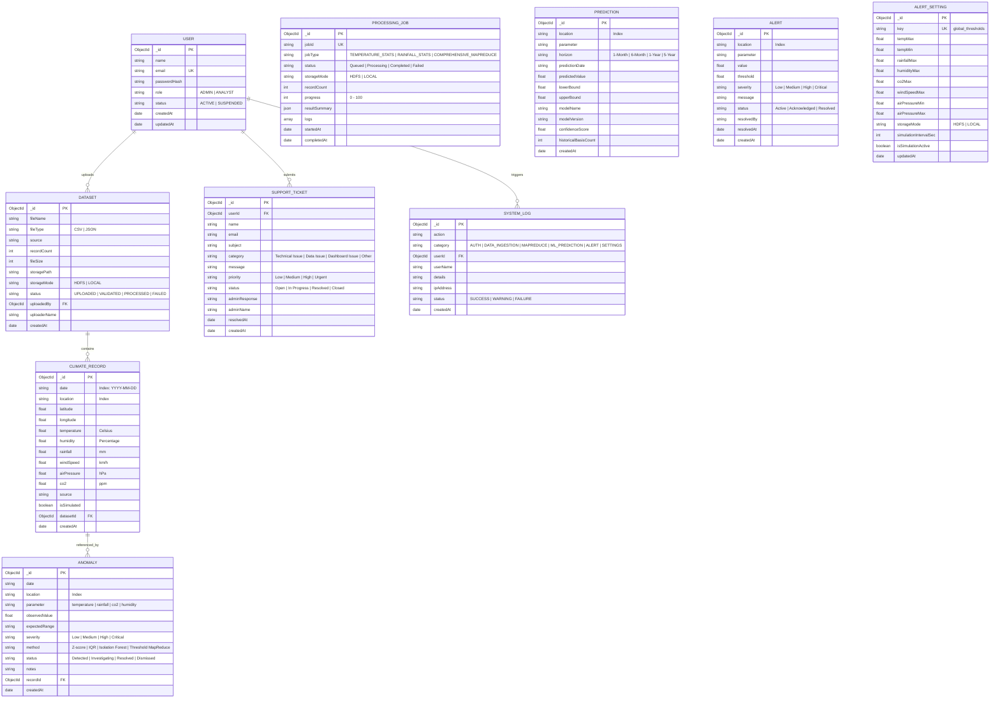

# EarthScape Climate Agency - Database Entity Relationship Diagram (ERD)

This document details the Entity Relationship Diagram and schema definitions for the operational database powering the EarthScape Climate Platform.

---

## Entity Relationship Diagram (Mermaid)

