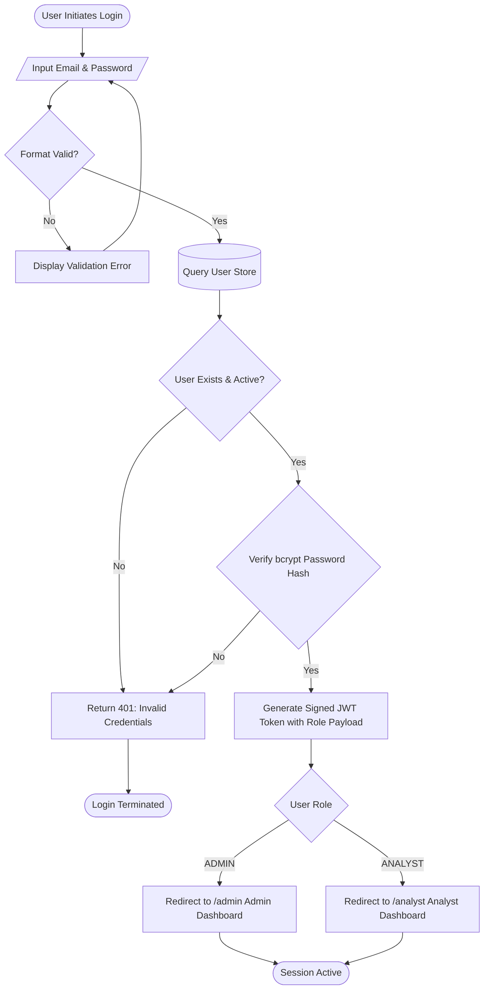
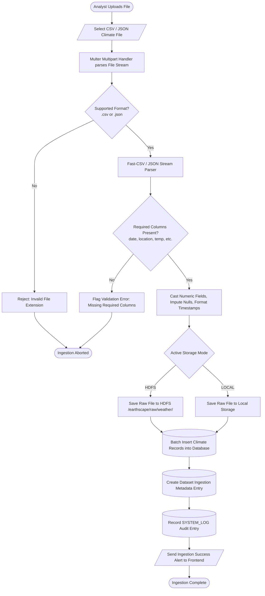
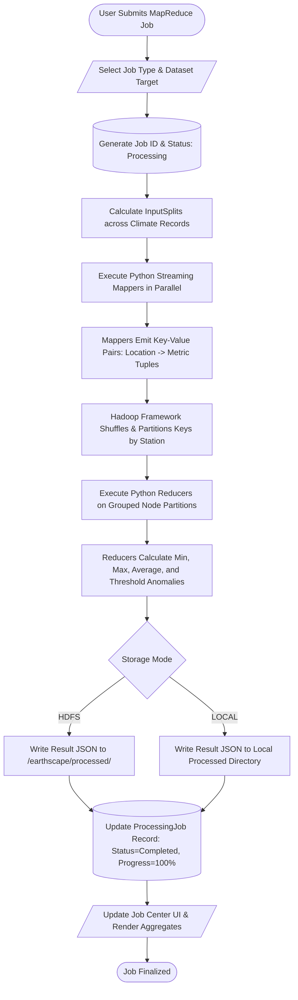
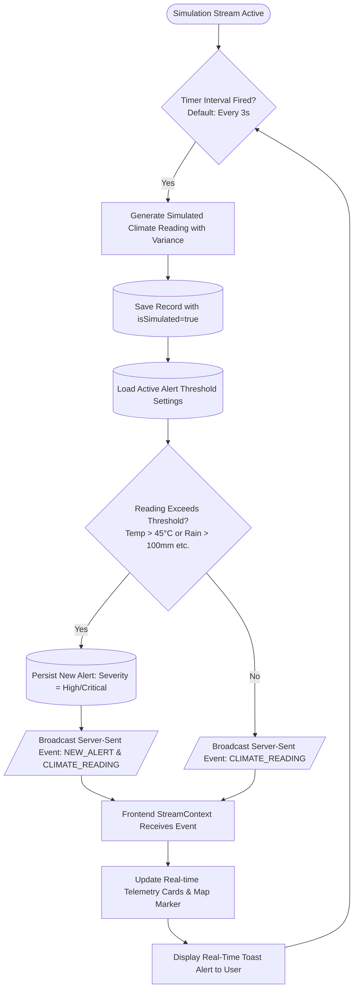

# EarthScape Climate Agency - Activity Flowcharts

This document specifies the operational flowcharts for all core business activities within the EarthScape Climate Platform.

---

## 1. User Authentication & Role Authorization Flowchart

---

## 2. Climate Data Ingestion & HDFS Persistence Flowchart

---

## 3. Hadoop MapReduce Job Execution Flowchart

---

## 4. Real-Time Streaming & Alert Evaluation Flowchart

