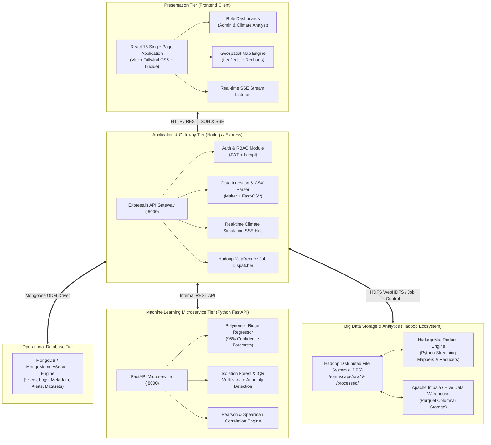

# EarthScape Climate Agency - System Architecture Documentation

This document illustrates the complete end-to-end multi-tier architecture of the **EarthScape Climate Monitoring and Analytics Platform**.

## Architectural Overview

The EarthScape system is engineered with a decoupled, high-performance distributed architecture spanning 4 key operational tiers:
1. **Presentation Tier (Frontend Client)**: Single Page Application built on React 18, Vite, and Tailwind CSS. Provides real-time geospatial interactive visualizations (Leaflet maps), time-series charts (Recharts), and role-tailored dashboards.
2. **Application & API Gateway Tier (Node.js/Express)**: Manages authentication (JWT, RBAC), request dispatching, file upload validation, MapReduce simulation dispatch, and real-time Server-Sent Events (SSE) data streaming.
3. **Big Data Storage & Processing Tier (Hadoop / HDFS / MapReduce / Impala)**: Fault-tolerant distributed storage in HDFS partitioned by location/date, with Python MapReduce mappers/reducers and Apache Impala for lightning-fast SQL warehouse queries.
4. **Machine Learning & Analytics Tier (Python FastAPI Microservice)**: Scikit-learn powered microservice delivering multi-algorithm anomaly detection (Isolation Forest, Z-Score, IQR), polynomial ridge trend regression, and statistical correlation calculations.

---

## Architecture Diagram (Mermaid)

---

## Tier-by-Tier Component Specifications

| Tier | Technology Stack | Key Responsibilities |
| :--- | :--- | :--- |
| **Presentation Tier** | React 18, Vite, Tailwind CSS, Lucide Icons, Recharts | Interactive dashboards, geospatial anomaly mapping, data ingestion forms, real-time alert toast indicators |
| **Gateway Tier** | Node.js v20+, Express 4.x, Multer, Fast-CSV | JWT token issue/validation, RBAC middleware, SSE event multiplexer, algorithmic fallback engines |
| **Big Data Tier** | Apache Hadoop 3.x, HDFS, Python Streaming MapReduce, Apache Impala | Distributed storage of terabyte-scale sensor files, parallel aggregations, high-concurrency analytical queries |
| **Machine Learning Tier**| Python 3.10+, FastAPI, Scikit-Learn, Pandas, NumPy | Anomaly score ranking, future time-series projection, covariance & correlation matrices |
| **Database Tier** | MongoDB 7.x / High-Performance In-Memory Mongo Engine | System configurations, user profiles, processed job logs, active threshold definitions, ticketing |
